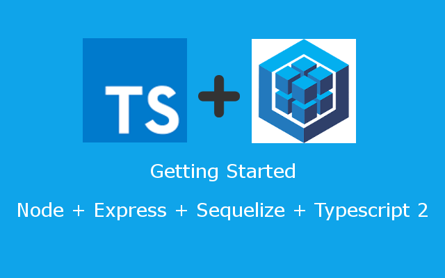

[](http://docs.sequelizejs.com)

[](https://travis-ci.org/maximegris/typescript-express-sequelize)
[](https://dependencyci.com/github/maximegris/typescript-express-sequelize)
[](https://github.com/maximegris/typescript-express-sequelize/blob/master/LICENSE.md)

# Introduction

Easily bootstrap your Typescript v2 project with NodeJS + Express + Sequelize ORM. :heart:

## Installation

Run one of the command below

```bash
npm install
```

```bash
npm install -g yarn
yarn
```

The build tasks use **Gulp tasks runner**. Typescript is transpiled to Javascript in the /build directory.
This sample use PostgreSQL database but you can easily change it and use your favorite relational database (npm or yarn command) :
```bash
npm install --save mysql // For both mysql and mariadb dialects
npm install --save sqlite3
npm install --save tedious // MSSQL
```

## Configure your database

Sequelize configuration and entities can be found in /Src/sqlz directory.

| Directory | Description |
|---|---|
| config  | Your database configuration. |
| migrations  | Your database migrations scripts. Keep this files in Javascript and run sequelize db:migrate to migrate your database schema. |
| models | Sequelize entities. |

First, define your database schema in config/config.json file.
Use [Sequelize CLI](http://docs.sequelizejs.com/en/v3/docs/migrations/) to initialize your database.

In models/ directory, the index.ts file define the DbConnection interface. When you create a new Sequelize entity, add its reference in this interface to fully use Typescript's superpower !

## Run the project

```bash
npm start
```

Your web server is now exposed on http://localhost:3000

### GET   /api/languages
curl -X GET -H 'Content-Type: application/json' http://localhost:3000/api/languages

### POST   /api/languages
curl -X POST -H 'Content-Type: application/json' -d '{"label":"French","name":"fr"}' http://localhost:3000/api/languages

### GET  /api/appusers
curl -X GET -H 'Content-Type: application/json' http://localhost:3000/api/appusers

### POST  /api/appusers
curl -X POST -H 'Content-Type: application/json' -d '{"email":"foo@bar.com","pwd":"something"}' http://localhost:3000/api/appusers

## Build

```bash
npm run build
```

## Lint your code before you commit!

In a collaborative project, it's always a pain when you have to work on files not correctly formatted.
Now beofre each commit, yout typescript files are linted based on your tsconfig.json >  .editorconfig > tslint.json files.

```bash
λ git commit -m "Example precommit"

> husky - npm run -s precommit

25l[14:22:30] Running tasks for src/**/*.ts [started]
[14:22:30] prettify [started]
[14:22:31] prettify [completed]
[14:22:31] git add [started]
[14:22:31] git add [completed]
[14:22:31] Running tasks for src/**/*.ts [completed]
25h25h[master 23c4321] Example precommit
 1 file changed, 1 insertion(+), 1 deletion(-)
```

By the way you can also run the command with a npm script

```bash
npm run prettify
```

## Debug with Typescript and VSCode

Add breakpoints to your Typescript source code and launch in VSCode the "Debug Typescript" task.
When you'll access to an endpoint, you will be able to debug directly in your Typescript's files.

## Questions and issues

The [github issue tracker](https://github.com/maximegris/typescript-express-sequelize/issues) is **_only_** for bug reports and feature requests.

## Roadmap
- [x] Add Sequelize Typescript example with association
- [x] Manage multiple database configuration with NODE_ENV
- [ ] Add Swagger API Framework
